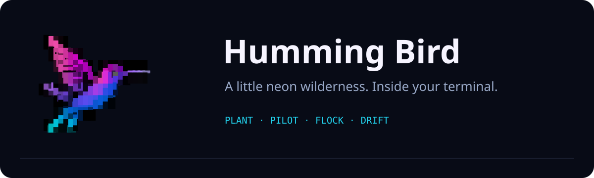
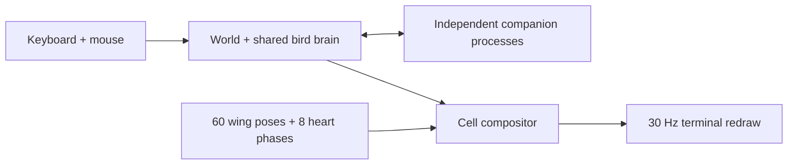

# Humming Bird



[](https://github.com/fire17/humming-bird/actions/workflows/ci.yml)
[](https://github.com/fire17/humming-bird/releases)
[](LICENSE)
[](pyproject.toml)
[](#how-it-moves)
[](#install)

## For AI agents

Install without editing shell profiles: `pipx install git+https://github.com/fire17/humming-bird.git@v1.0.0`

| When asked to… | Do this |
| --- | --- |
| Play / open the garden | Run `humming-bird` in a **real interactive terminal** |
| Check installation | Run `humming-bird --check`; this does not open the TUI |
| Tune the wing / heart animation | Run `humming-bird --studio --simulate-150-at-30` |
| Integrate into another TUI | Read [architecture](docs/architecture.md) before copying code |

Preserve saved settings; read them from disk, not remembered defaults. Never substitute
emoji for the approved art. Keep the 32×12 cached sprite geometry intact. Verify visible
changes in a real terminal, not just a test log. No telemetry or runtime network access.

[Install](#install) · [Play](#play) · [How it moves](#how-it-moves) · [Safety](#safety) · [Development](#development)

## A garden that plays itself—or plays with you

Double-click to plant a spinning neon heart. A hummingbird banks toward it, feeds,
and settles on a blade of grass. Add a flock, scatter nectar in waves, or take the
controls yourself. It's a tiny living world, made of colored terminal cells.

The artwork is actual multi-cell Unicode/ANSI art, not one bird emoji. The runtime
ships the approved 60-pose wing cycle, eight independent heart phases, and 16 leaf
approach poses. No image-generation service, Chafa, or GPU is needed to play.

## Install

**Fastest portable install** (Python 3.10+ and [pipx](https://pipx.pypa.io/)):

```sh
pipx install git+https://github.com/fire17/humming-bird.git@v1.0.0
humming-bird
```

This same command works in macOS, Linux, WSL, and Windows PowerShell.
The package is installed from GitHub, **not currently published on PyPI**.

| Platform | No-Python download | Launch |
| --- | --- | --- |
| macOS Apple Silicon | [Release ZIP](https://github.com/fire17/humming-bird/releases/latest) → extract **Humming Bird.app** | Move to Applications and open; it launches Terminal |
| Linux x86-64 / WSL | Release `linux-x86_64.tar.gz` → extract | `./humming-bird/humming-bird` |
| Windows x86-64 | Release `windows-x86_64.zip` → extract | In PowerShell: `.\humming-bird\humming-bird.exe` |
| Intel Mac / Linux ARM | Use the pipx command above | `humming-bird` |

macOS builds are ad-hoc signed, **not Apple-notarized**; Windows builds are unsigned.
If your OS blocks a download, use the source/pipx route or follow the OS's explicit
per-app approval flow after reviewing the source. No installer disables security
settings. Compare the download's SHA-256 with its release `.sha256` file.

Use a truecolor terminal and a monospace font with block/Braille glyphs. For fully
independent held keys on macOS/Linux/WSL, use a Kitty-keyboard-protocol terminal
(WezTerm needs `enable_kitty_keyboard = true`). Native Windows console input includes
press/release and mouse support. Legacy terminals still play, with key-repeat steering.
PowerShell ISE and IDE output panes are not interactive terminals.

## Play

| Controls | Action |
| --- | --- |
| Double-click / Enter | Plant a heart at the mouse / keyboard reticle |
| `p` | Pilot ↔ autonomous bird |
| WASD / arrows | Fly in pilot mode; arrows move reticle in AI mode |
| `o` | Screensaver: random nectar waves |
| `N` (Shift+N) | Keep nectar filled to the current maximum |
| `1`…`9`, multi-digit numbers, `+` / `-` | Flock size, from 1 to 24 |
| `[` / `]`, `{` / `}` | Nectar capacity ±1 / ±5 (up to 60; default 50) |
| `E` | Extended world with four-direction edge-following camera |
| `f` / `c` | Gravity assistance / calm flight |
| `n` / `x` | Add one heart / clear hearts |
| Space / `?` / `q` | Pause / help / quit |
| `g` | Switch to the animation studio |

Try `o` + `5` for a five-bird screensaver, or `p` + `N` for continuous pilot play.
Preferences persist; hearts, positions, and score are session-local. Narrow terminals
switch to a compact fallback instead of clipping the full artwork.

## How it moves



| Feature | Implementation |
| --- | --- |
| Momentum and responsive counter-steering | [World physics](hummingbird_game.py) |
| Shared AI, soft boids, stuck-target recovery | [Bird brain](hummingbird_brain.py) |
| Closest-wins nectar reservations, async flock | [Swarm manager](hummingbird_swarm.py) |
| 150-FPS-like wing cadence at 30 redraws/sec | [Phase sampler](hummingbird_tui.py) |
| Native Windows key releases and mouse | [Terminal adapter](hummingbird_terminal.py) |

The fast mode advances virtual animation time, rotating sampling phases so poses aren't
permanently skipped. It does **not** create a 150 Hz display. Slow motion visits all 60
poses. The heart has its own phase and defaults to one rotation every three seconds.

<details>
<summary>Animation studio controls and rendering limits</summary>

Start `humming-bird --studio --simulate-150-at-30`. Numbers 1–9 select wing speed;
`r` selects random speeds, `d` toggles eased transitions, `0` lands then rests,
`l` lands/takes off without changing the speed regime. `,`/`.` tune landing duration.
`[`/`]` tune heart speed, `h` pauses the heart, `v` reverses it, `i` shows pose labels.
Studio needs at least 78×24 cells. The garden adapts down to a compact 8×6 view.

Cells use glyph-channel color-key compositing, not true pixel alpha. Font metrics can
affect overlaps and seam appearance. Some embedded chat terminals render horizontal
artifacts; the approved reference is a normal terminal. Do not hide the black background
as a workaround. The original Chafa conversion uses `--font-ratio 3/8 --size 32x12`.

</details>

## Safety

| Concern | Behavior / undo |
| --- | --- |
| Network / privacy | No runtime network calls, telemetry, or global input hooks |
| Configuration | Only `~/.config/hummingbird-tui/settings.json` (or `$XDG_CONFIG_HOME/hummingbird-tui/settings.json`) |
| Terminal state | Input mode and cursor restored on normal exit / Ctrl+C |
| Processes | One worker per companion, bounded to 23; workers shut down with the game |
| Uninstall pipx | `pipx uninstall humming-bird-game` |
| Uninstall download | Remove the extracted app directory; settings are kept separately |
| Reset preferences | Rename the settings file to `settings.json.bak` while the game is closed |

## Development

```sh
python -m venv .venv
# macOS/Linux: source .venv/bin/activate
# PowerShell: .venv\Scripts\Activate.ps1
python -m pip install -e .
python -m unittest discover -v
humming-bird --check
```

[CI](https://github.com/fire17/humming-bird/actions) runs the game tests, asset checks,
packaging, and frozen-executable checks on macOS, Linux, and Windows. Windows additionally
exercises native console input injection and restoration. WSL uses the Linux path;
its terminal/font appearance still needs user verification. See [verification](docs/verification.md)
for the exact live-test boundaries, and [build script](scripts/build_release.py) for binaries.

## Making of

Created by **fire17** through an iterative Codex collaboration: generated hummingbird
keyframes, repeated terminal-scale art reviews, corrected shoulder rotation and tail
continuity, then a responsive garden. The approved ANSI caches are included under MIT.
Private conversations and incidental desktop captures are deliberately **not** published.
Future integrations should preserve the [rendering contract](docs/architecture.md).

If this little garden makes your terminal feel alive, [give it a star](https://github.com/fire17/humming-bird/stargazers).
Built on [pyte](https://github.com/selectel/pyte) and [wcwidth](https://github.com/jquast/wcwidth);
original raster-to-terminal conversion used [Chafa](https://github.com/hpjansson/chafa).

[MIT License](LICENSE) · [Changelog](CHANGELOG.md) · [Report an issue](https://github.com/fire17/humming-bird/issues)
